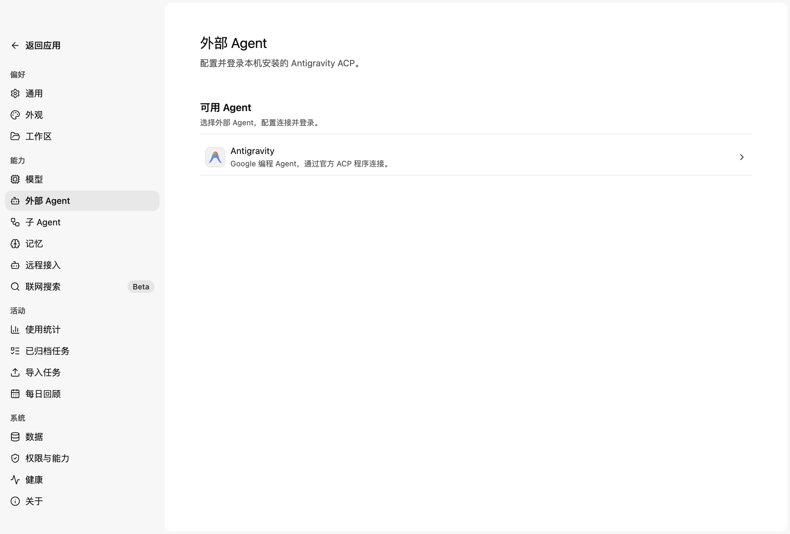
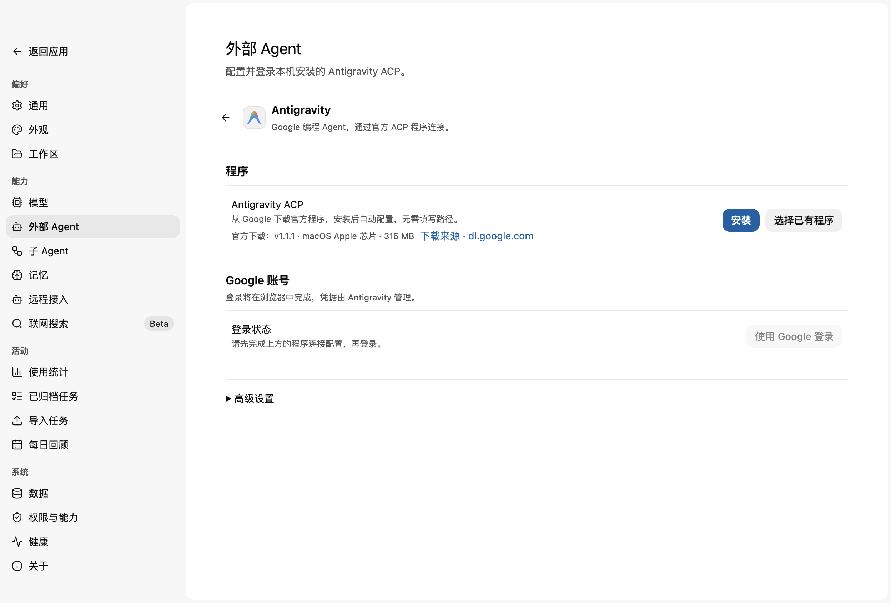
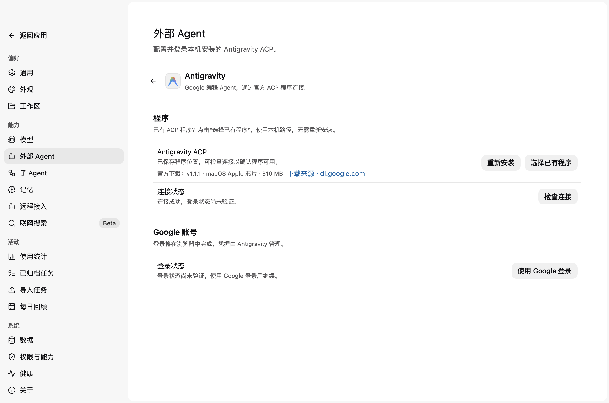

<!--
  Licensed to the Apache Software Foundation (ASF) under one
  or more contributor license agreements.  See the NOTICE file
  distributed with this work for additional information
  regarding copyright ownership.  The ASF licenses this file
  to you under the Apache License, Version 2.0 (the
  "License"); you may not use this file except in compliance
  with the License.  You may obtain a copy of the License at

      http://www.apache.org/licenses/LICENSE-2.0

  Unless required by applicable law or agreed to in writing,
  software distributed under the License is distributed on an
  "AS IS" BASIS, WITHOUT WARRANTIES OR CONDITIONS OF ANY
  KIND, either express or implied.  See the License for the
  specific language governing permissions and limitations
  under the License.
-->

# Antigravity ACP setup (PR1)

Settings → External Agents configures Antigravity on a local macOS arm64 Runtime Host. Install downloads Google's pinned ACP 1.1.1 distribution, verifies the archive and both executables, extracts into the Host state root under `external-agents/antigravity/1.1.1`, checks the connection, and saves the executable path through the existing Settings mutation. Download source links directly to Google's archive. The existing RuntimePolicy proxy configuration is used for downloads.

The Program section always shows Choose existing program beside Install/Reinstall, with a visible explanation that existing ACP installations can be reused. Selecting a file saves the native picker result through the existing Settings mutation; there is no separate path editor or Advanced settings foldout. A saved path is read on reopening but is not an authentication claim. There is no disk-wide or PATH discovery. The installer reuses a matching verified managed version without another download. Existing custom paths are only replaced by an explicit install or file selection, and late install responses cannot replace newer configuration. The Antigravity desktop application alone does not provide this ACP connection.

Only the executable path is persisted in RuntimePolicy document schema 4. Schemas 2 and 3 migrate with an empty path. Setup requests compare the saved path before admission; changing it invalidates displayed results. Connection success does not establish authentication. Official credentials remain under the official process's control, outside Maka's credential store.

The Host directly uses ACP SDK 1.4.0. Setup initializes the process without file or terminal capabilities and never creates a session or sends a prompt. Login selects the observed `oauth-personal` method. Its stderr authorization link is forwarded through the existing Desktop `oauth_presentation` capability. The subprocess environment sets `BROWSER=/usr/bin/true` to suppress the official process's own browser launch and `ANTIGRAVITY_HARNESS_PATH` to its sibling helper. No raw authentication output is retained by Maka.

One setup attempt, including installation, runs at a time. Installation has a 15-minute timeout, bounded download size, SHA-256 verification and per-attempt staging cleanup. Cancelling does not remove a completed managed installation. A config-save failure leaves the verified installation available for retry. Duplicate IDs return the existing attempt; retries use new IDs. Page/Host changes, client disconnect, timeout, drain and shutdown cancel the attempt. Terminal results follow bounded process-tree cleanup, including SIGKILL escalation. Failed cleanup drains the Host. Terminal attempt history is in memory and bounded to 32 records. Handshake timeout is 30 seconds; authentication timeout is five minutes.

## Official behavior observed on 2026-09-10

Source: [Google's official macOS arm64 ACP 1.1.1 archive](https://dl.google.com/agy-extensions/releases/macos/agy-acp-server-agy_acp_server_1.1.1-darwin-arm64.zip).

- `initialize` returned protocol 1 and agent version `agy_acp_server_1.1.1`.
- Advertised methods: `oauth-personal`, `oauth-business`, `gemini-api-key`, `agent-platform`. PR1 uses only Google personal OAuth.
- `authenticate` printed `Open the following link to authenticate the ACP server: ` followed by an HTTPS Google authorization URL to stderr. Unbuffered stderr was sufficient; no stdout prefix rewriting was needed.
- A real Desktop using isolated data saved the path and completed the connection check, displaying that login was unverified. A real login reached browser authorization; cancellation returned a cancelled state with no remaining server or helper process.
- The user completed Google browser authorization. The official authenticate request then returned JSON-RPC error -32000: account ineligible because Antigravity is unavailable in the current location. This observed response maps to the sanitized account_ineligible result. That initial account-eligibility blocker was cleared in the successful real-agent acceptance run below.

SHA-256 of the verified distribution files:

```text
agy_acp_server.par    9d900b93031fc42397f88206e14eba4193729bbef631a70b18e7a19631a6dfac
localharness_external e0a8ef9d80a1ffb178f945159dda33f73d4a5be65516642542352584b834fa2a
```

## Real acceptance on 2026-09-11

The official ACP 1.1.1 distribution was exercised through the built Desktop and real local Runtime Host using isolated application data. No credentials, raw authentication output or private account details were recorded.

- A production installer run downloaded Google's full archive and verified it. Desktop cancellation removed staging and preserved the prior configuration; retry installed both executables, completed the ACP handshake and saved the managed path.
- With the verified official program, Desktop completed connection checking and Google login. A subsequent login was cancelled while its ACP process was live; Retry completed a fresh login.
- Restart, page departure, client shutdown and Host shutdown preserved configuration as designed and released owned server/helper processes. Every observed success, failure and cancellation terminal state left no temporary process.
- At the user's request, the final login sequence reused the verified program in `/tmp` instead of repeating the slow full download. Managed download and automatic-save evidence came from the earlier run.
- The final flattened UI keeps Install/Reinstall and Choose existing program visible. The native picker selection saves directly; no path editor or Advanced settings section remains.

These are PR1 setup checks only. No external task, prompt, model selection, session restoration or remote-Host flow was exercised.







The [successful Google login screenshot](images/pr/antigravity-current-login-success.png) predates the final visual flattening and is retained only as authentication evidence.

## Regression evidence

Controlled tests cover strict policy migration, installer integrity and cleanup, real SDK stdio boundaries, setup admission/deduplication/cancellation, delayed browser presentation, all three UI locales, native existing-program selection, Settings persistence and stale Host/configuration results.

Compatibility epoch is 144 (merged main is 142), combining Antigravity setup with explicit missing/archived Session refusals for Skill queries. Full build/typecheck, lint, format, Desktop Knip, renderer architecture, protocol compatibility and third-party notice checks passed during PR verification. Complete affected Host, Desktop and CLI suites passed; current follow-up changes additionally pass the 15 focused Settings page tests and renderer architecture check. GitHub CI remains the final source of truth for the latest head.
