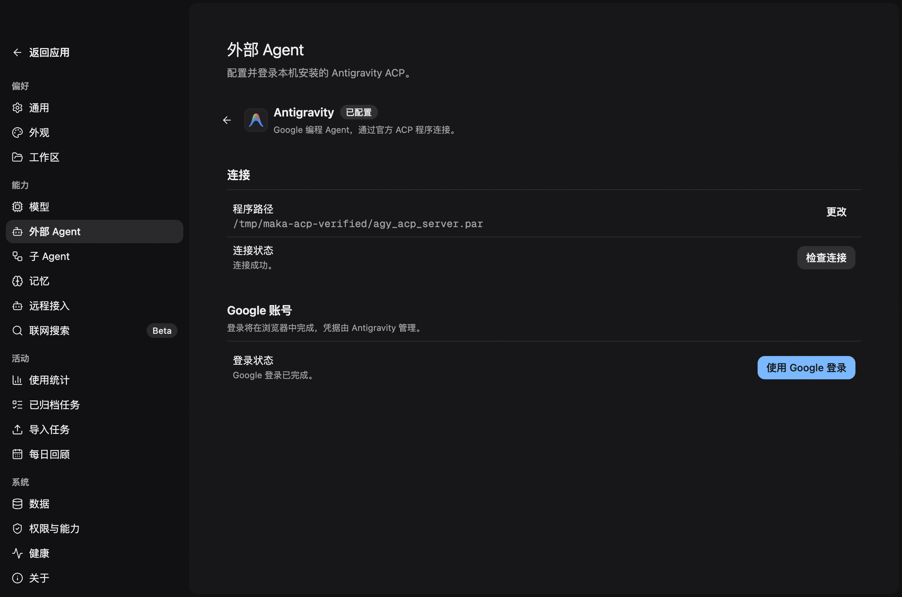

<!--
  Licensed to the Apache Software Foundation (ASF) under one
  or more contributor license agreements.  See the NOTICE file
  distributed with this work for additional information
  regarding copyright ownership.  The ASF licenses this file
  to you under the Apache License, Version 2.0 (the
  "License"); you may not use this file except in compliance
  with the License.  You may obtain a copy of the License at

      http://www.apache.org/licenses/LICENSE-2.0

  Unless required by applicable law or agreed to in writing,
  software distributed under the License is distributed on an
  "AS IS" BASIS, WITHOUT WARRANTIES OR CONDITIONS OF ANY
  KIND, either express or implied.  See the License for the
  specific language governing permissions and limitations
  under the License.
-->

# Antigravity ACP setup (PR1)

Settings → External Agents configures Antigravity on a local macOS arm64 Runtime Host. Install downloads Google's pinned ACP 1.1.1 distribution, verifies the archive and both executables, extracts into the Host state root under `external-agents/antigravity/1.1.1`, checks the connection, and saves the executable path through the existing Settings mutation. Download source links directly to Google's archive. The existing RuntimePolicy proxy configuration is used for downloads.

Already-installed programs can be selected with the native file picker and saved; advanced settings retain manual path entry. A saved path is read on reopening but is not an authentication claim. There is no disk-wide or PATH discovery. The installer reuses a matching verified managed version without another download. Existing custom paths are only replaced by an explicit install/save action, and late install responses cannot replace newer configuration. The Antigravity desktop application alone does not provide this ACP connection.

Only the executable path is persisted in RuntimePolicy document schema 4. Schemas 2 and 3 migrate with an empty path. Setup requests compare the saved path before admission; editing it invalidates displayed results. Connection success does not establish authentication. Official credentials remain under the official process's control, outside Maka's credential store.

The Host directly uses ACP SDK 1.4.0. Setup initializes the process without file or terminal capabilities and never creates a session or sends a prompt. Login selects the observed `oauth-personal` method. Its stderr authorization link is forwarded through the existing Desktop `oauth_presentation` capability. The subprocess environment sets `BROWSER=/usr/bin/true` to suppress the official process's own browser launch and `ANTIGRAVITY_HARNESS_PATH` to its sibling helper. No raw authentication output is retained by Maka.

One setup attempt, including installation, runs at a time. Installation has a 15-minute timeout, bounded download size, SHA-256 verification and per-attempt staging cleanup. Cancelling does not remove a completed managed installation. A config-save failure leaves the verified installation available for retry. One attempt runs at a time. Duplicate IDs return the existing attempt; retries use new IDs. Page/Host changes, client disconnect, timeout, drain and shutdown cancel the attempt. Terminal results follow bounded process-tree cleanup, including SIGKILL escalation. Failed cleanup drains the Host. Terminal attempt history is in memory and bounded to 32 records. Handshake timeout is 30 seconds; authentication timeout is five minutes.

## Official behavior observed on 2026-09-10

Source: [Google's official macOS arm64 ACP 1.1.1 archive](https://dl.google.com/agy-extensions/releases/macos/agy-acp-server-agy_acp_server_1.1.1-darwin-arm64.zip).

- `initialize` returned protocol 1 and agent version `agy_acp_server_1.1.1`.
- Advertised methods: `oauth-personal`, `oauth-business`, `gemini-api-key`, `agent-platform`. PR1 uses only Google personal OAuth.
- `authenticate` printed `Open the following link to authenticate the ACP server: ` followed by an HTTPS Google authorization URL to stderr. Unbuffered stderr was sufficient; no stdout prefix rewriting was needed.
- A real Desktop using isolated data saved the path and completed the connection check, displaying that login was unverified. A real login reached browser authorization; cancellation returned a cancelled state with no remaining server or helper process.
- The user completed Google browser authorization. The official authenticate request then returned JSON-RPC error -32000: account ineligible because Antigravity is unavailable in the current location. This observed response maps to the sanitized account_ineligible result. That initial account-eligibility blocker was cleared in the successful real-agent acceptance run below.

SHA-256 of the verified distribution files:

```text
agy_acp_server.par    9d900b93031fc42397f88206e14eba4193729bbef631a70b18e7a19631a6dfac
localharness_external e0a8ef9d80a1ffb178f945159dda33f73d4a5be65516642542352584b834fa2a
```

## Successful real-agent acceptance on 2026-09-11

The same official ACP 1.1.1 distribution was exercised through the built Desktop and its real Runtime Host in an isolated application data directory. The Google account holder completed browser authorization; no credentials were copied into Maka or into fixtures. A separate sanitized SDK probe confirmed protocol 1, agent version `agy_acp_server_1.1.1`, an empty successful `authenticate` result (`{}`), and completed process cleanup.

- **Initial login:** the official SDK authenticate request completed successfully, and Desktop displayed “Google 登录已完成。” only after setup cleanup. No `agy_acp_server.par` or `localharness_external` process remained.
- **Restart:** Desktop and its Host were both stopped and restarted. The saved executable path survived; login status initially remained unverified. A connection check succeeded without claiming authentication. A subsequent login succeeded without another browser authorization, exercising the official credential state.
- **Cancel and retry:** a real login was cancelled while connecting. Desktop reached the cancelled state, the process exited, and Retry completed a new successful login.
- **Page departure:** returning to the agent list during login released the process. Reopening setup showed unverified status rather than a stale result.
- **Client quit request:** SIGTERM was delivered to the isolated Desktop while an official setup process was observed running. The setup process exited; remaining test-application processes were subsequently stopped separately.
- **Host shutdown:** SIGTERM was delivered to the owning Host while its official setup process was observed running. Both Host and setup process exited; the Desktop generation reset without retaining the old result.

These are PR1 setup checks only: no external task, prompt, model selection or session restoration was exercised. Switching to a different configured Host target remains covered by controlled generation/ownership tests, not a separate real remote-Host acceptance run.



## Regression evidence

Controlled tests use real SDK stdio subprocesses for handshake, split authentication output, rejection, crash, timeout, browser failure, cancellation and a helper ignoring SIGTERM. Coordinator tests cover deduplication, saved-path admission, platform/ownership restrictions, disconnect/drain and browser addressing. Desktop tests cover all three locales, double-click guards, stale Host generations, changed configuration and retry with a new attempt.

The affected package builds, Desktop type checks, renderer architecture check against main, protocol epoch check (141 → 142 after merging current main), third-party notices check, existing OAuth tests and the CLI ACP server regression suite pass. No task execution, model catalog, session restoration or additional workspace package is introduced.

On 2026-09-11, full repository build and typecheck, lint, format, Desktop/UI Knip and ASF header checks passed. The first full `npm test` run found an outdated CLI remote-owner exclusion assertion and four Host failures (three readiness timeouts and one Run-state assertion). The CLI assertion now includes all three local-only setup operations; no remote grants were added. The complete CLI suite then passed (926 passed, 3 skipped). All four affected Host files passed with file concurrency 1 (58 tests), and the complete Host suite passed independently with its normal test command (1,842 passed, 12 skipped). Other workspace suites passed in the initial full run. The original concurrent `npm test` invocation was not green; these independent reruns are recorded separately rather than claiming a clean full concurrent run.

After merging upstream main `898ac52d9`, the compatibility epoch is 142 (main is 141). The test build, full typecheck, lint, format and renderer architecture check against upstream/main passed. The full workspace test run passed everywhere except one existing filesystem queue-identity test that relies on fixed 50 ms waits. Its file passed independently (15 tests), and the complete Runtime suite then passed independently (3,405 passed, 13 skipped), without changing that test or production filesystem code. Host (1,859 passed, 12 skipped), Desktop (2,503 passed) and CLI (934 passed, 3 skipped) passed in the full run.

## Managed installation follow-up

The approved UI revision extends PR1 with managed installation; it supersedes the original no-auto-install boundary. Compatibility epoch is 143. Controlled installer tests cover real ZIP extraction, executable hashes and permissions, cached reuse, tampered/truncated/oversized data, stalled-download cancellation and staging cleanup. Host tests cover empty-path install admission, single-attempt deduplication, handshake-only verification and strict result decoding. Desktop tests cover automatic Settings persistence, stale configuration rejection and selecting an existing program.

Managed-install acceptance used both a direct production installer run and the built Desktop with an isolated real Host. Google's full archive downloaded and verified successfully. Desktop cancellation removed its staging directory and preserved the previously saved path; retry installed both official executables, completed an ACP handshake, and saved the managed absolute path via Settings. No ACP server/helper remained. A subsequent sign-in was started but the page was changed before its final result was recorded; it is not counted as a new successful real-login acceptance. The earlier successful same-version authentication record above remains separate.

Validation: full build/typecheck, lint, format, Desktop Knip and renderer architecture passed. The complete Host suite passed (1,865 passed, 12 skipped), Desktop passed (2,506 tests), and CLI passed (934 passed, 3 skipped). The final focused installer/setup/IPC/UI suite passed 40 tests, including the added cancel/disconnect/drain checks.
