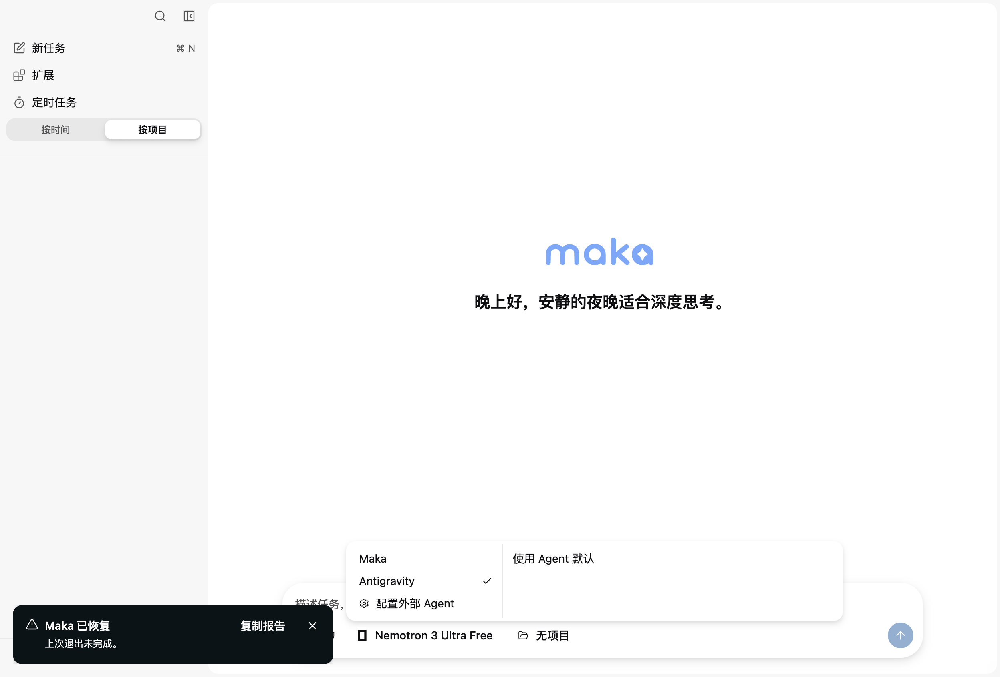
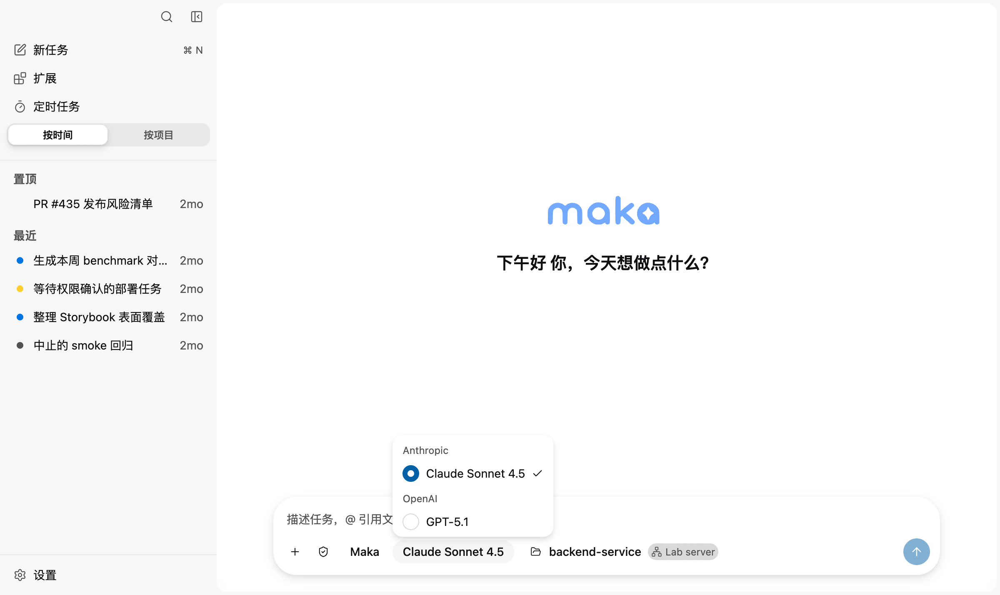

<!--
  Licensed to the Apache Software Foundation (ASF) under one
  or more contributor license agreements.  See the NOTICE file
  distributed with this work for additional information
  regarding copyright ownership.  The ASF licenses this file
  to you under the Apache License, Version 2.0 (the
  "License"); you may not use this file except in compliance
  with the License.  You may obtain a copy of the License at

      http://www.apache.org/licenses/LICENSE-2.0

  Unless required by applicable law or agreed to in writing,
  software distributed under the License is distributed on an
  "AS IS" BASIS, WITHOUT WARRANTIES OR CONDITIONS OF ANY
  KIND, either express or implied.  See the License for the
  specific language governing permissions and limitations
  under the License.
-->

# PR2 官方二进制前置验证记录

验证日期：2026-09-12。平台：macOS arm64。ACP SDK：1.4.0。官方 Antigravity ACP：1.1.1。状态：**实际任务执行被提供方拒绝，未通过验收**。

## 程序来源与隔离

程序使用 [PR1 固定的官方发行包](../antigravity-acp-settings.md)，未修改官方二进制。SHA-256：

| 文件                    | SHA-256                                                            |
| ----------------------- | ------------------------------------------------------------------ |
| `agy_acp_server.par`    | `9d900b93031fc42397f88206e14eba4193729bbef631a70b18e7a19631a6dfac` |
| `localharness_external` | `e0a8ef9d80a1ffb178f945159dda33f73d4a5be65516642542352584b834fa2a` |

在独立临时项目中执行，测试文件为公开的加法函数和断言。RPC 有期限，所有官方进程及 helper 已完成进程树清理。没有写入真实项目文件、改系统代理或切换模型来绕过提供方拒绝。

## 认证与代理差分

1. 初始 `session/new` 返回 Authentication required。用户在官方 Google 页面完成认证后，`authenticate` 返回 `{}`。
2. 系统同时配置 HTTP、HTTPS、SOCKS 代理，初始子进程没有代理环境变量。`session/new` 稳定返回 `-32603`，诊断为 `python-socks is required to use a SOCKS proxy`。
3. 保持程序、凭据和请求相同，仅向子进程显式传入已有 HTTP 代理的 `HTTP_PROXY` 和 `HTTPS_PROXY`，`initialize → session/new` 成功，无需再次打开登录页。
4. 未发送模型或模式设置请求。官方返回默认模型 `gemini-3.7-flash-high`、模式 `default`。这些只是此次观测值，不是产品硬编码配置。

推论：仅继承进程环境会触发官方 Python 的 macOS SOCKS 自动发现问题。产品应消费 Maka 已准入的 HTTP/HTTPS 代理，且不能将 SOCKS 端点自动转换为 HTTP。

## Prompt 的实际结果

两轮 prompt 的 RPC 均返回：

```json
{ "stopReason": "end_turn" }
```

但 assistant 文本均为执行错误，包含 HTTP 403、`PERMISSION_DENIED`、`UNSUPPORTED_LOCATION`；没有输出约定的 `ACP_DEFAULT_OK` 标记。首次 probe 仅按 RPC 成功判定，随后已纠正为检查实际消息与业务结果，记录 `assessment.accepted: false`。

登录成功、session 创建成功、prompt RPC 正常结束这三个事实，均不足以证明任务执行成功。真实错误文本必须保留可见；后续执行状态设计不能把它们当作验收成功依据。

## 仍未验证的行为

- 文件读写、执行测试、工具通知、diff、权限拒绝、提问。
- 有效同会话多轮、普通取消后续聊、等待权限时取消、完成与取消竞争。
- 运行中异常退出、helper 清理对当前轮的影响。
- 成功任务的跨进程 resume/load 可行性。

这些行为没有证据，并非已证明不支持。`initialize` 声明的能力不能替代实际行为验证。不得降低计划验收标准，也不继续对已被拒绝的账号重复提交工具任务。

## 本地复现材料

此 worktree 的 `output/pr2-probe/` 保存脱敏 JSON 与脚本：`README.md`、`probe.mjs`、`session-new-check.mjs`。原始账号凭据、授权 URL 均不包含在记录中。

- `new-red-2.json`：无显式 HTTP 代理环境的 session 创建失败。
- `new-http-proxy.json`：只改变子进程代理环境后的创建成功。
- `default-prompt-http-proxy.json`：两轮实际错误文本及失败验收结论。

恢复条件：提供方允许当前开发环境实际执行官方默认 prompt。恢复后先重跑完整真实验收 gate，再推进依赖这些行为的 PR2 产品实现。

## 自动化验证的边界

本轮新增基础设施测试使用本地 SDK fixture；它们验证代理传递、认证证据和已观察进程的清理，不能替代以上官方任务验收。

尚未验证官方程序及 helper 对 `NO_PROXY` 通配符的解释是否等价于 Maka。原生 Python urllib 不支持 Maka 的全部通配格式；传递代理环境不代表两套绕过规则已实现等价。

原有进程树终止工具在父进程退出后无法追溯从未观察到、且已脱离原进程组的 daemon。不得将已知 helper 的清理测试宣称为任意 daemon 的生命周期保证；官方任务崩溃时的进程清理仍属于后续真机 gate。

本轮曾以真实本地 helper 和针对该 PID 的 `SIGKILL` / `EPERM` 注入复现“已发现逃逸 helper 存活，dispose 却成功”的缺陷；现已修复为保留进程身份并验证退出后才成功。回归覆盖重试、身份变化、未知身份和不再向已释放的旧进程组发送信号。

## 后续验证更新（2026-09-12）

本节更新前文的验证状态。用户要求保持 VPN 设置不变；此次验证未修改 VPN 设置。

- 官方 ACP 1.1.1 的实际多文件编辑、diff 和独立 fixture 测试通过。
- 在不同进程中调用 resume 和 load 的可行性探测通过，三个 probe 进程组均已清理；PR2 尚不实现跨进程恢复。
- 新增 AcpAgentBackend 的真实双轮 smoke 返回 `PR2_FIRST_OK` 和 `PR2_SECOND_OK`，两轮均以 end_turn 结束，释放 residency 且未报告清理失败。
- 修复没有原生 modelId 时丢弃 ACP assistant 文本的问题：新增回归先失败，修复后通过。Runtime read-model 74 项、SessionManager 166 项、Core/Storage/Host catalog 103 项相关测试通过，Desktop typecheck 通过。

尚未通过：完整 Desktop 端到端验收、Renderer architecture 检查（AppShell 新增状态及代码量超过冻结限额）。格式检查、完整受影响测试集及 CLI ACP 回归尚待补齐。后端 smoke 不能代替 Desktop 任务创建、工具与表单显示、取消和重启后的历史验收。

另一个开发 worktree 的 schema version 14 启动错误不属于此次 PR2 隔离实例；多个 Electron 应用身份重合导致窗口选择混淆。窗口控制接口仍超时，完整 UI 证据未取得。

当前任务执行实现仍是 Draft：会话可用性投影、原生专用操作准入、混合有序工具内容、ACP 原始停止原因、启动阶段取消、配置失效及完整生命周期仍需要按计划逐项核对。

## Checklist 实现与回归收口（2026-09-12）

本轮已补齐上述 Draft 项，并保留此前官方二进制验证的边界：

- Host 只允许 ACP live task 接收普通消息；压缩、重生成、分支/修订和工作区迁移均以 `operation_unavailable` 拒绝。CLI 也显式拒绝接管 Desktop-only ACP Session。
- Session catalog 使用非持久化的 `available | history_only` 投影表达进程内可继续性。Host 重启或 ACP 连接丢失后历史仍可读，但发送被拒绝，Desktop 提供本地化的新建任务入口。
- 原生模型、凭据和 OAuth 配置更新不再销毁 ACP backend；Host 关闭、任务删除和 ACP 故障仍执行完整清理。
- 取消覆盖初始化、`session/new`、prompt 和权限等待窗口，整个取消通知受同一超时约束；正常完成会清理定时器。provider 原始 stop reason 写入 durable RuntimeEvent。
- ACP 工具结果按到达顺序保存文本、全部 diff 和 terminal 引用；Core 严格解码、Runtime 持久化、Desktop/CLI 展示均覆盖新联合类型。
- 新任务 Composer 合并为左右两栏的执行者/模型选择器。未发送草稿中的 Maka 模型选择会跨执行者浏览保留；首条消息成功投影后下一份草稿恢复 Maka。ACP 附件不会被删除，但发送会被阻止并显示本地化说明。
- AppShell 的 slash-command 与只读提示投影已移到 conversation feature；冻结的 Hook、依赖和 token 预算检查通过。

验证结果：全工作区 typecheck、lint、Git diff 校验、全部 103 项 Renderer architecture 检查通过。Core 829 项、Runtime Host 1934 项（1922 通过、12 跳过）、Desktop 2550 项、UI 419 项、CLI 937 项（934 通过、3 跳过）及 Eval 的 Node/Python 测试均无失败。首次三工作区并发全量运行中，一个依赖真实模型的 Runtime Host 用例超时；隔离重跑及 Runtime Host 全量串行重跑均通过。

Runtime 全量测试另有两项既有 Zod 递归引用契约在当前依赖环境稳定失败；其余 3431 项通过、13 项跳过，本次新增和受影响 Runtime 用例全部通过。仓库跟踪文件及本轮新增文件均通过格式检查；本地未跟踪的 `output/` 复现材料仍保持原样，因此直接对整个工作目录运行 formatter 会报告其中的证据文件。

## Desktop 官方账号截图验收（2026-09-12）

在 `/tmp/maka-pr2-desktop-e2e-v3` 隔离 user-data 下，以当前 worktree 的 production renderer 启动真实 Electron 窗口并连接官方 ACP 1.1.1。没有修改系统代理、Clash/VPN 配置或 Maka 持久设置；仅在本次 Desktop 进程环境中显式传入机器上既有的 HTTP 代理入口，避开前文已记录的 macOS SOCKS 自动发现问题。Google 登录由官方 ACP 缓存恢复，设置页显示“已验证 Google 登录”。

人工操作与截图结果：

- 旧版新任务执行者/模型双栏选择器能切换到 Antigravity，但后续回归发现复合选择器会用旧执行者状态覆盖刚选中的 Maka 模型。当前实现将“执行者 + 保留的 Maka 模型”作为一个目标原子提交；UI 将执行者和模型分成两个控件，Maka 与外部 Agent 的模型筛选均按 `upstream/main` 的主线框式交互使用 Astryx 弹出菜单，不使用滚动滚轮。

变更前（已替换的复合双栏菜单）：



变更后（当前 Storybook production component/frame，Maka 使用主线弹出菜单）：



变更后的浏览器可访问树确认模型筛选器是 `menu` / `menuitemradio`，且不存在 `.maka-model-wheel-viewport`；真实 hook + 首次发送回归则确认精确连接和模型会原样进入 `newTasks.create`。
- 真实任务进入 ACP 权限表单，显示 provider 工具 `pwd`、请求者 `Antigravity · ACP` 以及 Allow / Deny 选项。一次性 Allow 后，`pwd` 与 `client_view_file` 工具活动按到达顺序显示，最终文本包含实际 worktree 路径与 `README.md` 第一行。
- 另一轮一次性 Allow 后运行 `sleep 30`，在工具执行期间点击 Composer“停止”。工具结果显示 `context canceled` / `The request was cancelled by the client.`，轮次显示“已中断”，没有等待命令自然完成。
- 重启同一 Desktop 实例后重新打开上述成功任务，用户消息、工具活动及最终文本保持可读；Composer 显示“Antigravity 会话已结束”，并提供“新建任务”入口，不能继续向旧进程会话发送消息。

原始官方账号截图保存在隔离临时目录 `/tmp/maka-pr2-screenshot-acceptance.QJvM72/`；其中旧菜单截图已作为变更前证据归档到仓库。`16-antigravity-tool-result.png`、`20-antigravity-cancelled.png`、`21-antigravity-history-only-after-restart.png` 分别对应成功工具结果、运行中取消和重启只读历史。附件发送阻断仍由已通过的 Desktop/UI 自动化用例覆盖；原生文件选择器同时受到另一开发 worktree 的 Electron 对话框占用，本轮没有把其他 worktree 的文件带入该隔离任务。

## 模型选择后无法发送的复查（2026-09-13）

- Maka 的 Codex 订阅模型把 `models.dev` 公开 OpenAI API 的 `inputLimit=922000` 与订阅入口实际发布的 `contextWindow=272000` 合并，形成输入上限大于总窗口的无效事实，因此请求在 provider 调用前以 `Model input limit exceeds the context window` 失败。OAuth 入口现在只继承通用模型元数据，不再继承另一访问路径的 input limit；真实本地 `gpt-5.6-sol` 配置解析为 `272000`。
- Antigravity 选择已正确写入 `backend=acp` 与 `externalAgentId=antigravity`。失败原因是 Runtime Host 重启会按安全策略清除进程内认证证据，旧首发路径仍先创建 Session，随后 `prepareExecution` 以 `authentication_failed` 阻断。新路径在 Session 创建前查询证据；未验证时自动运行官方登录，验证成功后才继续原首发，失败或未配置时不留下空的 blocked Session。
- 本机官方 `agy_acp_server.par` 与 `localharness_external` 连接检查通过。完整回归：Desktop 2605/2605、UI 445/445、Core 830/830、Runtime 3486 通过且 13 项按既有条件跳过；Renderer architecture 112/112 并通过 `upstream/main` 债务比较。Biome、locale hygiene、模型元数据同步检查和 Git diff 校验通过。
